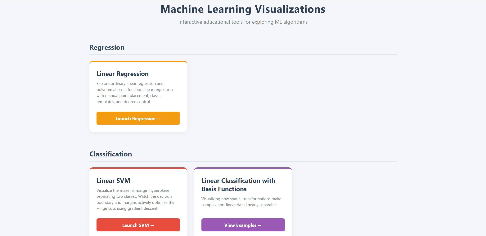
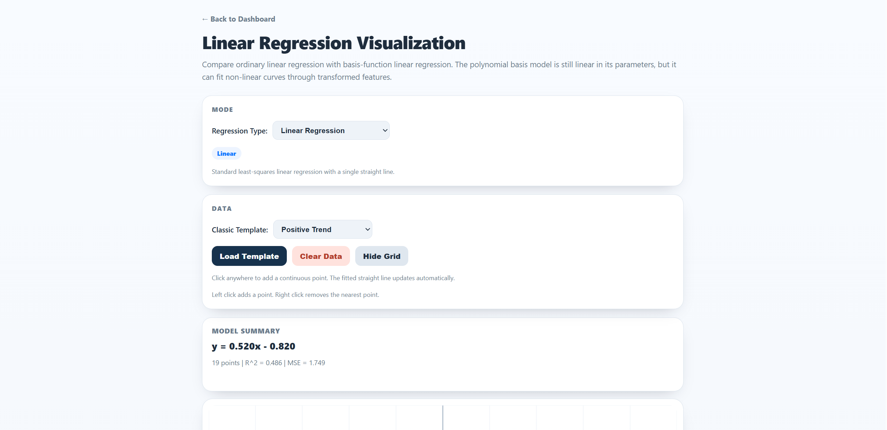
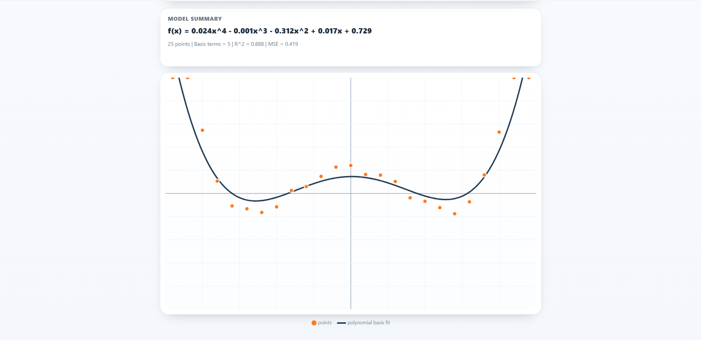
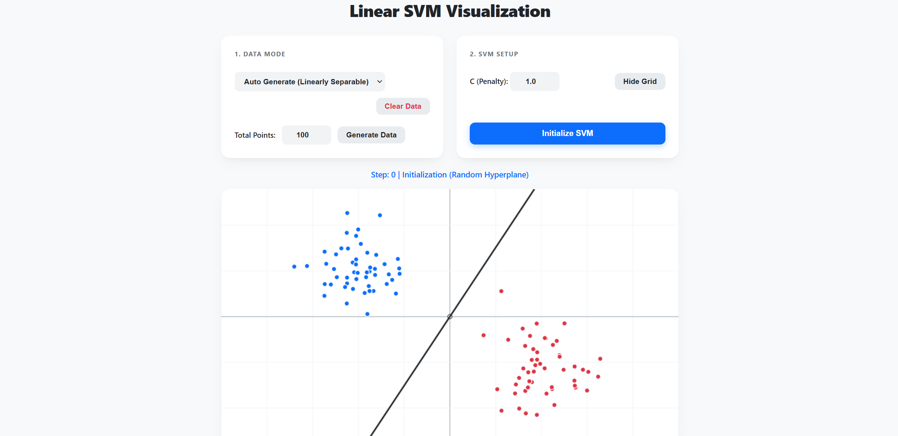
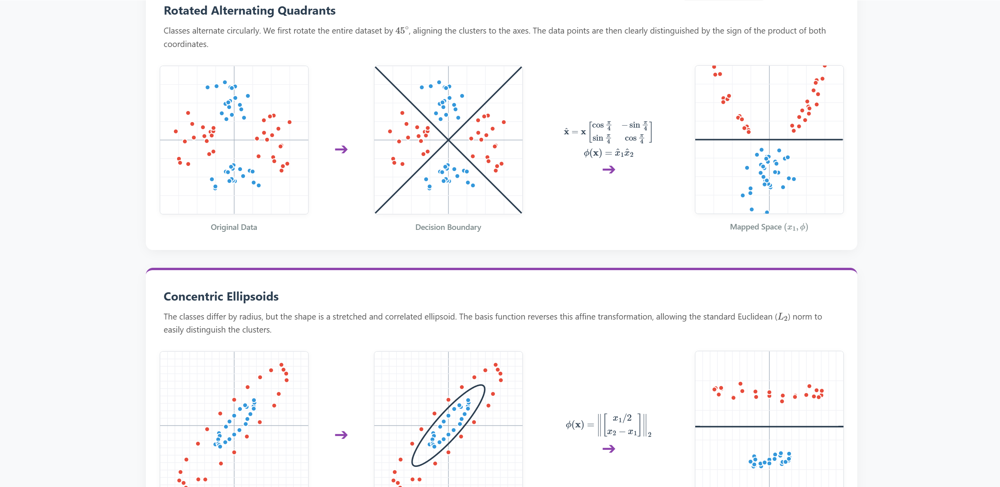
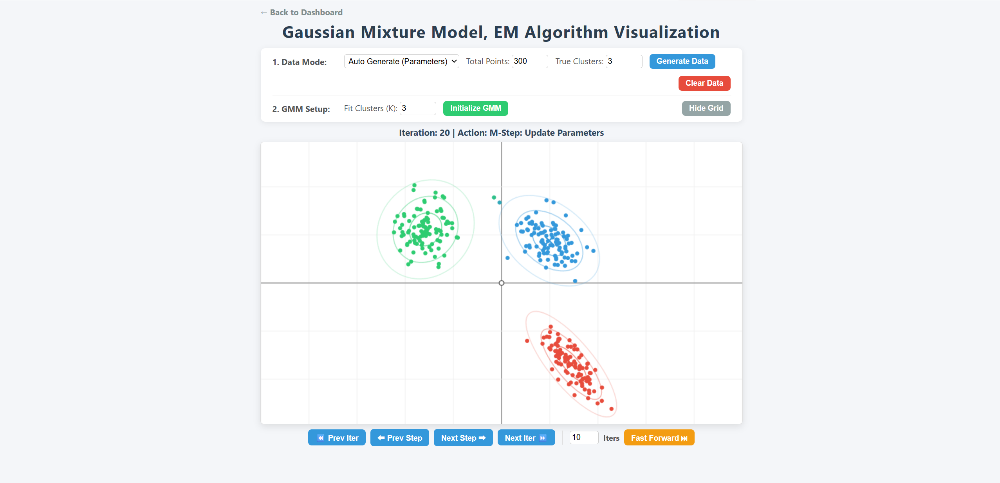

# Machine Learning Algorithm Visualizations

[](https://machine-learning-visualization.onrender.com)
[](https://www.python.org/)
[](https://flask.palletsprojects.com/)

An interactive web app for exploring fundamental machine learning algorithms through direct manipulation and visual feedback.

Live Demo: [https://machine-learning-visualization.onrender.com](https://machine-learning-visualization.onrender.com)

Note: The backend is hosted on Render's free tier. After inactivity, the service may sleep, so the first load can take 1-2 minutes.

---

## About

This project is designed as a lightweight educational tool for building intuition about how machine learning models behave. The backend handles numerical computation in Python, while the frontend uses HTML5 Canvas and vanilla JavaScript for interactive visualization.

The project currently includes interactive pages for regression, classification, and clustering.


## Screenshots


















---
## Supported Visualizations

### Regression

1. **Linear Regression**
   - Fit a straight line to manually placed 2D points.
   - View the fitted line together with summary metrics such as R^2 and MSE.

2. **Linear Regression with Basis Functions**
   - Fit a linear model over polynomial basis functions.
   - Adjust the polynomial degree to see how the fitted curve changes.
   - View the expanded polynomial form directly in the model summary.

### Classification

3. **Linear SVM**
   - Visualize the separating hyperplane for two classes.
   - Step through gradient-based optimization and observe support vectors.
   - Adjust the penalty parameter `C` to compare margin behavior.

4. **Linear Classification with Basis Functions**
   - A static visual gallery showing how basis transformations make non-linear data linearly separable.
   - Includes examples such as stripes, sine waves, checkerboards, parabolas, and concentric structures.
   - Uses LaTeX-rendered equations to explain the feature mappings.

### Clustering

5. **Gaussian Mixture Model (EM)**
   - Visualize soft assignments during Expectation-Maximization.
   - Step separately through E-steps and M-steps.
   - Observe means, covariances, and confidence ellipses evolve over time.

6. **K-Means Clustering**
   - Visualize hard assignments and centroid updates.
   - Inspect Voronoi-style decision regions as centroids move.
   - Step through assignment and update phases iteratively.

---

## Key Features

- Interactive point placement directly on the canvas.
- Classic template datasets for regression examples.
- Polynomial degree control for basis-function regression.
- Step-by-step playback for iterative algorithms such as SVM, GMM, and K-Means.
- Forward and backward navigation through saved algorithm states.
- Fast-forward controls for jumping multiple iterations at once.
- Clean coordinate-grid visualizations built with HTML5 Canvas.

---

## Local Installation

1. Clone the repository:
   ```bash
   git clone https://github.com/Archerui/Machine-Learning-Visualization.git
   cd Machine-Learning-Visualization
   ```

2. Install dependencies:
   ```bash
   pip install -r requirements.txt
   ```

3. Run the app:
   ```bash
   python app.py
   ```

4. Open:
   `http://127.0.0.1:5000`

